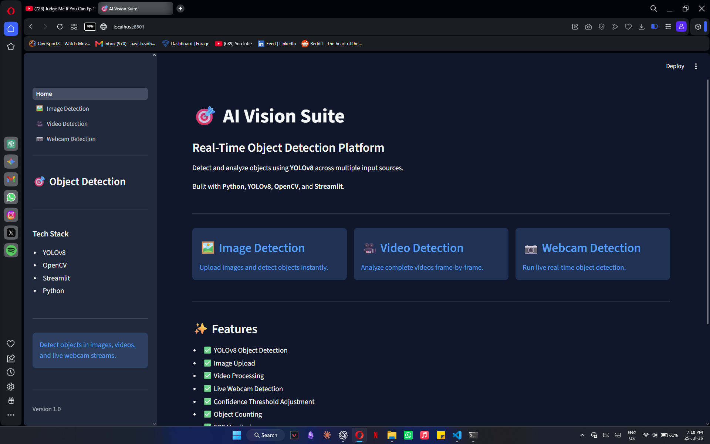
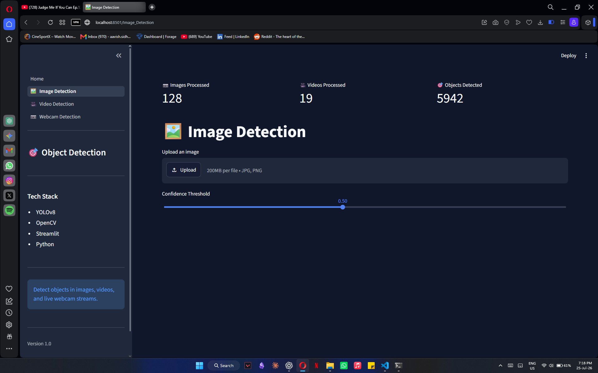
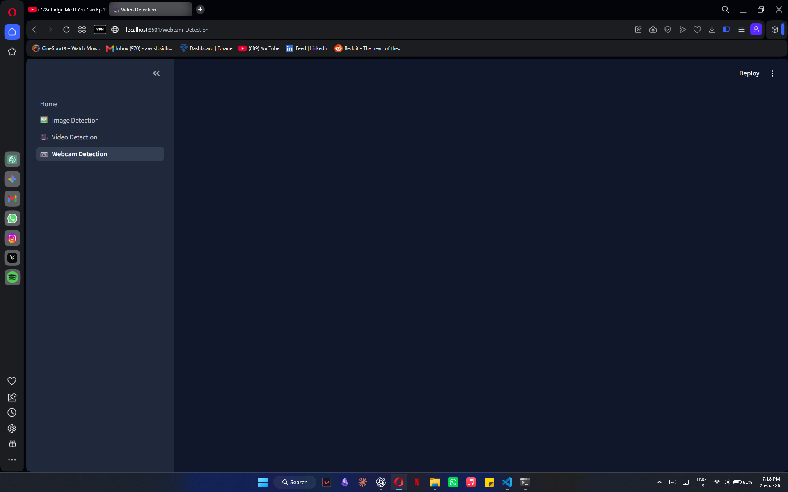
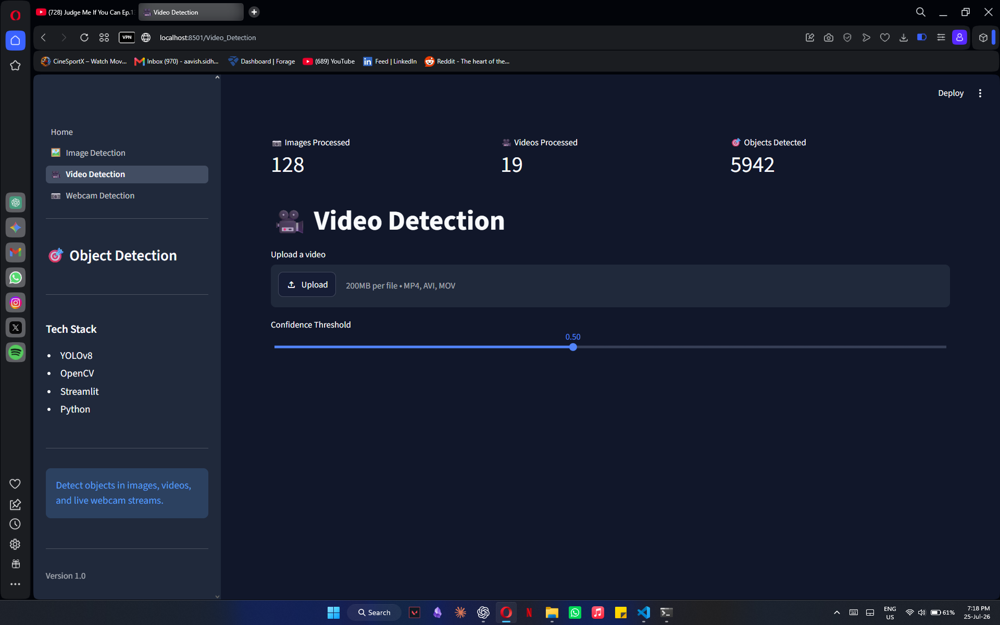

# 🎯 AI Vision Suite

A modern Computer Vision application built with **YOLOv8**, **OpenCV**, and **Streamlit** that performs real-time object detection on images, videos, and webcam streams.

---

## ✨ Features

- 🖼️ Image Object Detection
- 🎥 Video Object Detection
- 📷 Live Webcam Detection
- 🎯 Adjustable Confidence Threshold
- 📊 Detection Statistics Dashboard
- ⚡ YOLOv8 Inference
- 🌙 Modern Streamlit UI

---

## 🛠️ Tech Stack

- Python
- YOLOv8 (Ultralytics)
- OpenCV
- Streamlit
- NumPy

---

## 📂 Project Structure

```text
real-time-object-detection/

├── app/
│   ├── Home.py
│   ├── pages/
│   └── components/
│
├── data/
│
├── models/
│
├── scripts/
│
├── src/
│
└── README.md
```

---

## 🚀 Installation

Clone the repository

```bash
git clone https://github.com/AavishSidhu/real-time-object-detection.git
```

Create a virtual environment

```bash
python -m venv .venv
```

Activate it

### Windows

```powershell
.\.venv\Scripts\Activate.ps1
```

Install dependencies

```bash
pip install -r requirements.txt
```

Run the application

```bash
python -m streamlit run app/Home.py
```

---

## 📸 Screenshots

### Home



### Image Detection



### Video Detection


### Webcam Detection


---

## 🔮 Future Improvements

- Object Tracking
- Face Detection
- OCR Integration
- Docker Support
- FastAPI Backend
- Cloud Deployment

---

## 👨‍💻 Author

**Aavish Sidhu**